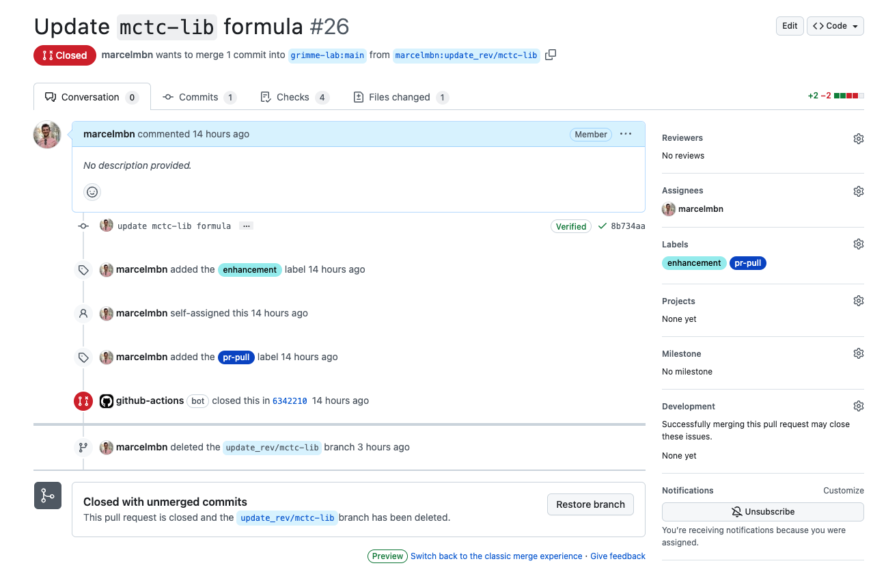

# Brew formulas for Grimme Lab software and related libraries

## Using grimme-lab/qc

This repository provides package build instructions for **Grimme Lab** and associated software compatible with the [Homebrew toolchain](https://brew.sh).

You can install, e.g., *xtb* by tapping this repository

```brew tap grimme-lab/qc```\
```brew install xtb```

Available programs are

- **Grimmme Lab Software:**
  - [xtb](https://github.com/grimme-lab/xtb):
    Semiemprical extended tight-binding program package
  - [dftd4](https://github.com/dftd4/dftd4):
    Generally applicable, charge-dependent London-dispersion correction
  - [s-dftd3](https://github.com/dftd3/simple-dftd3):
    Simple reimplementation of the D3 dispersion correction
  - [gcp](https://github.com/grimme-lab/gcp):
    Geometrical counter-poise correction
  - [mctc-lib](https://github.com/grimme-lab/mctc-lib)
    Modular computation tool chain library
- **Associated Software:**
  - [crest](https://github.com/crest-lab/crest):
    Conformer-rotamer ensemble search tool
- **Fortran Language Community:**
  - [mstore](https://github.com/grimme-lab/mstore):
    Molecular structure storage for testing purposes
  - [test-drive](https://github.com/fortran-lang/test-drive)
    Simple Fortran testing framework
  - [toml-f](https://github.com/toml-f/toml-f)
    TOML parser implementation for data serialization and deserialization in Fortran

## Developer Notes

### How to update the formulae

1. Switch to new branch on your fork of the repository
2. Update the formulae in the `Formula` directory (e.g., `mctc-lib.rb`), keeping the following style:

    ```ruby
    url "https://github.com/grimme-lab/mctc-lib/archive/refs/tags/v0.3.2.tar.gz"
    sha256 "b18b06f80e6274b353dd091c12b3a83217033ce0bd80471b54cf486cc60c0251"
    ```
    The `sha256` hash can be obtained by running
    ```sh
    curl -sL "https://github.com/grimme-lab/mctc-lib/archive/refs/tags/v0.3.2.tar.gz" | shasum -a 256 | cut -d " " -f 1
    ```
3. Commit the changes and push to your fork. Within the same branch (PR), **DO NOT** change anything else.
4. Create a pull request to the main repository. **DO NOT** put the `pr-pull` label on it yet.
5. Make sure that the tests `.github/workflows/tests.yml` pass and that the bottles are uploaded correctly for each platform.
   - You can check the `artifacts` by downloading them from the GitHub Actions summary of your PR (scroll down).
6. After all tests have passed and the `artifacts` are available, request a review from the repository maintainers.
7. After approval, label the PR with the `pr-pull` label to trigger the merge action.
8. The PR should look roughly as follows:

    

You can find out how the process should look like [here](https://brew.sh/2020/11/18/homebrew-tap-with-bottles-uploaded-to-github-releases/).

## License

The package build files are available under a BSD-2-Clause license.
